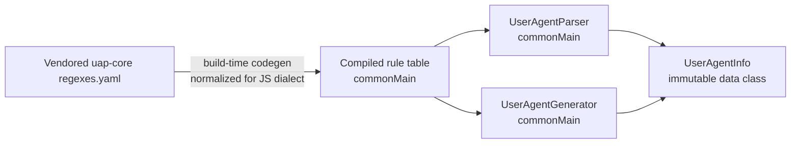
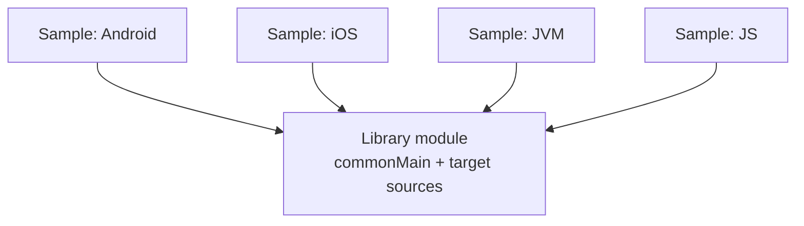

# Architecture Spine — kmp-user-agent

## Design Paradigm

Common-Kotlin-first, data-driven regex engine. All parse and generate logic lives in `commonMain` as pure Kotlin operating over an immutable, compiled-in rule table. `kotlin.text.Regex` is part of the common stdlib on every MVP target (JVM, JS, Native), so no `expect`/`actual` split exists for the matching engine itself — the one real per-target wrinkle (JS's regex dialect, AD-1) is absorbed at codegen time, not with platform code.



## Invariants & Rules

### AD-1 — Rule data is build-time-compiled Kotlin, one table per type pack, normalized for every target's regex dialect

- **Binds:** CAP-1, CAP-2, CAP-3
- **Prevents:** (a) four different per-platform resource-loading mechanisms becoming a fifth thing to keep in sync; (b) the codegen author and the parser author independently inventing incompatible table shapes; (c) patterns that compile on JVM/Native silently throwing `SyntaxError` on JS; (d) a consumer who only wants one detection category being forced to load them all.
- **Rule:** Browser/OS/device detection patterns are vendored from `uap-core`'s `regexes.yaml` (Apache-2.0, attribution per AD-6) and converted into `commonMain` Kotlin source by a Gradle code-gen task at build time — no target loads the rule set as a runtime resource. **(Amended 2026-09-04, Sprint Change Proposal)** The generated tables are organized **one per type pack** — `browserRules`, `engineRules`, `osRules`, `deviceRules`, `botRules`, `aiAgentRules` — each its own top-level `commonMain` value, so a JS build that references only some packs can dead-code-eliminate the rest. Within a table, entries are evaluated in file order, first match wins, using `uap-core`'s replacement-template fields (`family_replacement`, `v1_replacement`, `v2_replacement`, etc.) for the categories vendored from it (browser/OS/device). `botRules` and `aiAgentRules` have no `uap-core` source section to vendor from; they are a small hand-seeded starter list (e.g. Googlebot/Bingbot/curl-class bots; GPTBot/ClaudeBot/PerplexityBot-class AI agents) — explicitly not exhaustive, extensible by consumers via custom packs (AD-3). Because Kotlin/JS's `Regex` hardcodes the ECMAScript `u` flag and 140+ upstream patterns use escapes illegal under it (e.g. `\-`, `\!`, `\ `), the codegen task strips/normalizes such non-metacharacter backslash escapes **uniformly for all targets** (a safe no-op on JVM/Native) so every target compiles the identical generated pattern set.

### AD-2 — One symmetric data model for parse and generate, with a fixed concrete shape

- **Binds:** CAP-1, CAP-2, CAP-3
- **Prevents:** The parse direction and the generate direction independently settling on incompatible shapes (nested vs. flat, differing field types); a new type pack having nowhere to put its output.
- **Rule:** `UserAgentInfo(browser: Component?, engine: Component?, os: Component?, device: Device?)` with `Component(name: String?, version: String?)` and `Device(brand: String?, model: String?, name: String?)`. Version stays a plain `String?` (no parsed semver) for v1. This one class is both `UserAgentParser`'s output and `UserAgentGenerator`'s input; neither direction defines a parallel model. **(Amended 2026-09-04, Sprint Change Proposal)** `UserAgentInfo` gains `bot: Component?` and `aiAgent: Component?` as first-class fields for the two new built-in packs (AD-1), plus a small extension point for data a custom pack contributes beyond the built-in fields — exact shape (e.g. a `custom: Map<String, Component>?`) is a dev-story-level decision, not an architecture-level one.

### AD-3 — Stateless public API, one canonical factory per direction, composed from type packs

- **Binds:** CAP-1, CAP-2, CAP-3
- **Prevents:** A target-specific cache/singleton changing behavior between platforms, or two independently-built call sites binding to two different spellings of the same operation; a consumer being forced to load detection categories they don't use.
- **Rule (superseded 2026-09-04, Sprint Change Proposal; refined 2026-09-04 during Story 4.1 implementation):** ~~The public surface is exactly `UserAgentParser.parse(String): UserAgentInfo` and `UserAgentGenerator.generate(UserAgentInfo): String`.~~ The public surface is two factory functions: `UserAgentParser(vararg packs: UserAgentTypePack): (String) -> UserAgentInfo` and `UserAgentGenerator(vararg packs: UserAgentTypePack): (UserAgentInfo) -> String`. Passing no packs returns an always-empty result (**not** an implicit `UserAgentAllTypes` fallback — Story 4.1 found that a fallback referencing `UserAgentAllTypes` inside the factory body gives every call site, regardless of arguments, a static reachability edge to every built-in pack under standard JS bundlers' module-level tree-shaking, defeating AD-1's per-pack tree-shaking goal). Consumers wanting everything call `UserAgentParser(UserAgentAllTypes)` explicitly. Still stateless: no mutable shared state, no caching beyond the read-only compiled tables from AD-1. Still exactly one entry point per direction — no coexisting alternate spelling. Built-in packs (`UserAgentBrowserTypes`, `UserAgentEngineTypes`, `UserAgentOsTypes`, `UserAgentDeviceTypes`, `UserAgentBotTypes`, `UserAgentAIAgentTypes`, and the bundling `UserAgentAllTypes`) and the custom-pack shape are documented alongside the API. This is a breaking change from the original Epics 1–2 API; the next publish (Epic 4) is a new major version.

### AD-4 — Library's production code depends on nothing but the Kotlin stdlib; samples depend on the library, never the reverse

- **Binds:** CAP-3, CAP-4
- **Prevents:** The library accidentally coupling to UI-framework code (Compose Multiplatform, React) that lives in this repo's existing app-template modules.
- **Rule:** Every production source set (`commonMain`, `androidMain`, `iosMain`, `jvmMain`, `jsMain`) depends only on the Kotlin stdlib. `commonTest` may depend on `kotlin.test` (required by AD-5) — this is test tooling, not a production dependency, and doesn't weaken this rule. Each MVP target's sample/test app depends on the library module; the library module never depends on a sample app.



### AD-5 — Shared test corpus, enforced on all four targets

- **Binds:** CAP-1, CAP-2
- **Prevents:** Each target quietly acquiring its own pass/fail bar for the same capability.
- **Rule:** One `commonTest` data set (seeded from a subset of `uap-core`'s own Apache-2.0 test fixtures, plus hand-picked cases for CAP-2) runs via `kotlin.test` identically on all four MVP targets, as a CI gate on every change. Pipeline specifics are deferred, but "run the shared corpus on all four targets" is not — that's what makes this AD enforceable rather than aspirational.

### AD-6 — License and provenance

- **Binds:** CAP-4
- **Prevents:** A copyleft dependency slipping in, or the vendored `uap-core` data losing its required attribution.
- **Rule:** Only MIT/Apache-2.0/BSD-licensed dependencies and vendored data are permitted anywhere in the library or its build. The vendored `uap-core` snapshot's Apache-2.0 notice is preserved in a `NOTICE` file shipped alongside every published artifact.

### AD-7 — npm packaging comes from the build's own dist output

- **Binds:** CAP-4
- **Prevents:** The npm package becoming a hand-maintained artifact that drifts from what the Kotlin/JS build actually produces.
- **Rule:** The npm package is produced from the `js(IR)` target's own Gradle dist output via `org.jetbrains.kotlin.npm-publish` (the mature `dev.petuska.npm.publish` lineage, v3.7.x) wired into the same build — no hand-authored `package.json`, no manually copied files.

## Consistency Conventions

| Concern | Convention |
| --- | --- |
| Naming | Public types: `UserAgentInfo`, `Component`, `Device`, `UserAgentParser`, `UserAgentGenerator`. Root package `site.lempert.useragent`. No platform suffixes on shared names. |
| Data & formats | `UserAgentInfo`/`Component`/`Device` fields are nullable where a UA string doesn't carry that data; never a sentinel string like `"unknown"`. |
| State & cross-cutting | No logging, no exceptions for "not recognized" data — a partially-populated `UserAgentInfo` is the result, not an error (AD-3). |

## Stack

| Name | Version |
| --- | --- |
| Kotlin / Kotlin Multiplatform Gradle plugin | 2.4.10 |
| com.vanniktech.maven.publish | 0.37.0 (Sonatype Central Portal host) |
| uap-core regexes.yaml (vendored snapshot) | Apache-2.0, pinned commit at vendor time |
| kotlin.test | bundled with Kotlin 2.4.10 |
| org.jetbrains.kotlin.npm-publish | v3.7.x lineage (continuation of dev.petuska.npm.publish) |

## Structural Seed

```text
kmp-user-agent/
  library/                     # the KMP library module (name pending artifact-id decision)
    src/
      commonMain/kotlin/        # UserAgentParser, UserAgentGenerator, UserAgentInfo, generated rule table
      commonTest/kotlin/        # shared test corpus (AD-5)
      androidMain/ iosMain/ jvmMain/ jsMain/   # expected to stay near-empty per the paradigm
    build.gradle.kts            # KMP targets + com.vanniktech.maven.publish + npm-publish config
    NOTICE                      # uap-core Apache-2.0 attribution (AD-6)
  samples/
    android/ ios/ jvm/ js/      # one thin harness app per MVP target, depends on :library (AD-4)
  androidApp/ iosApp/ webApp/ sharedLogic/ sharedUI/   # existing app-template modules; candidates to repurpose as samples/ or retire — left to bmad-build
```

## Capability → Architecture Map

| Capability | Lives in | Governed by |
| --- | --- | --- |
| CAP-1 Parse | `library` commonMain (`UserAgentParser`) | AD-1, AD-2, AD-3, AD-5 |
| CAP-2 Generate | `library` commonMain (`UserAgentGenerator`) | AD-1, AD-2, AD-3, AD-5 |
| CAP-3 Common API | `library` public surface, one shape per target | AD-2, AD-3, AD-4 |
| CAP-4 Publish | `library/build.gradle.kts` + root publishing config | AD-6, AD-7, Stack |

## Deferred

- Exact library artifact id under the `site.lempert` namespace (open question carried from SPEC-user-agent).
- Whether to repurpose existing `androidApp`/`iosApp`/`webApp`/`sharedLogic`/`sharedUI` as the `samples/` harnesses or build fresh minimal ones — a build-time call, not an architecture-level divergence risk.
- Vendored `uap-core` snapshot refresh cadence — no process decided yet; fine for a v1 MVP.
- CI/CD pipeline specifics beyond AD-5's "run on all four targets" mandate (assumed GitHub Actions, unconfirmed) — deferred to `bmad-build`.
- Wasm/WasmJs target, broader detection coverage, bot-detection features — all out of scope per SPEC-user-agent non-goals, not this spine's concern.
