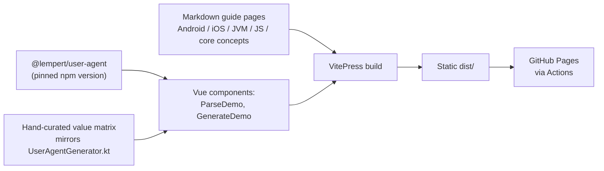
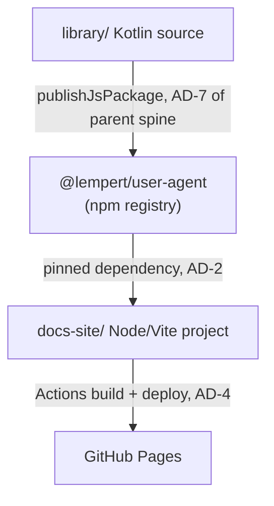

# Architecture Spine — kmp-user-agent-docs-site

## Design Paradigm

Static-site-generator with a Vue-powered interactive demo. VitePress (Vite + Vue, Markdown-first) owns page structure, navigation, and search so independently-added guide pages can't drift from each other; the two pieces of real interactivity (live parse, filter-driven generate) are Vue single-file components embedded in Markdown pages, hydrated client-side like the rest of a VitePress site (full Vue hydration, not an Astro-style islands architecture). The site is an external consumer of the library — it imports the published `@lempert/user-agent` npm package exactly as any other JS/TS consumer would, never the in-repo Kotlin source.



## Inherited Invariants

This spine sits under the existing `kmp-user-agent` initiative spine (`_bmad-output/planning-artifacts/architecture/architecture-kmp-user-agent-2026-09-01/ARCHITECTURE-SPINE.md`). Its `AD`s below are read-only, binding constraints on this feature — not re-derived, never renumbered here.

| Inherited | From parent | Binds here |
| --- | --- | --- |
| AD-3 (stateless public API: `UserAgentParser(vararg packs)` / `UserAgentGenerator(vararg packs)` factories) | kmp-user-agent initiative spine | The demo's parse/generate components call exactly these two factory functions on the published package — no reimplementation, no alternate entry point. |
| AD-4 (library depends on nothing but stdlib; consumers depend on the library, never the reverse) | kmp-user-agent initiative spine | The docs site is a consumer like any sample app: it may depend on the published package; the library must never gain a dependency on the docs site. |
| AD-7 (npm packaging comes from the build's own dist output) | kmp-user-agent initiative spine | The demo must consume the real published `@lempert/user-agent` artifact (AD-2 below) — that guarantee is what makes AD-7 meaningful to a docs-site visitor. |

## Invariants & Rules

### AD-1 — Site is a standalone Node/Vite project outside the Gradle build, consuming the library only as a published dependency

- **Binds:** all
- **Prevents:** the docs site accidentally depending on in-repo Kotlin source, a Gradle project reference, or a local `file:` dependency — any of which would let the demo silently diverge from what a real npm consumer experiences, and would pull Node tooling into the Kotlin multi-module build.
- **Rule:** The site lives in its own top-level `docs-site/` folder with its own `package.json`, entirely outside `settings.gradle.kts`. Its only link to the library is a normal npm dependency on the published `@lempert/user-agent` package (AD-2).

### AD-2 — The live demo depends on a pinned, hand-bumped version of the published npm package — never "latest," never reimplemented

- **Binds:** the intro page's ParseDemo and GenerateDemo components
- **Prevents:** the demo silently changing behavior on every npm publish with no reviewable site-side change; a hand-written JS reimplementation of parse/generate drifting from the real library; two builders independently resolving different transitive dependency trees for the same declared version.
- **Rule:** `docs-site/package.json` declares an exact or caret-pinned version of `@lempert/user-agent` (starting at `0.2.0`), with `docs-site/package-lock.json` committed alongside it; the build/deploy workflow (AD-4) runs `npm ci`, never `npm install`, so a build only ever resolves the exact locked tree. Bumping the version is a deliberate commit made when the demo should pick up a new release — `dependencies` never point at `latest`. **The same commit that bumps this version must also re-check `generateSupportMatrix.ts` (AD-3) against the new release's `UserAgentGenerator.kt`/changelog and update it if supported values changed** — a version bump and a matrix update are one PR, not two independently-compliant ones. All parse/generate calls in the demo go through the imported package's exported `UserAgentParser`/`UserAgentGenerator` factories; no parse/generate logic is duplicated in the site.
- **Rule:** `ParseDemo.vue` calls `UserAgentParser(UserAgentAllTypes)` (the visitor's own `navigator.userAgent` should resolve every recognized field, including bot/AI-agent, on this general-purpose demo). `GenerateDemo.vue` calls `UserAgentGenerator(UserAgentBrowserTypes, UserAgentEngineTypes, UserAgentOsTypes, UserAgentDeviceTypes)` — exactly the four packs AD-3's matrix covers, and no others, so every matrix-advertised option is guaranteed renderable and no matrix option silently no-ops against a pack that wasn't passed. Adding bot/AI-agent to the generate demo (Deferred) requires extending both the packs passed here and the matrix together, not one alone.

### AD-3 — The generate demo's filter options and randomizer draw from one hand-maintained file of complete, known-valid presets — not independent per-field lists

- **Binds:** GenerateDemo's dropdowns and its "randomize unset fields" behavior
- **Prevents:** the demo offering (or randomly assembling) a filter combination `generate()` silently can't render correctly — e.g. a "Windows 11" option when the generator only ever accepts OS name `"Windows"` with version `"10"`; or a technically-valid-per-field combination that `UserAgentGenerator.kt`'s `generateOsToken` treats as an `unsafeCombination` and silently drops the OS token for (confirmed: Firefox+Android, Firefox+iOS, Safari+Android all produce a browser segment with no OS parenthetical) — either failure mode makes the demo look broken with no code-level error to catch it.
- **Rule:** One file, `docs-site/src/demo/generateSupportMatrix.ts`, is the single source of truth. It exports a list of **named, complete presets** — each a full `{browser, engine, os, device}` tuple already confirmed to produce a real, non-degraded `generate()` output — never independent per-field option arrays that GenerateDemo would cross-product itself. "Randomize a field the visitor left unset" means: pick a random preset, then take only the unset field(s) from it, keeping the visitor's own selections for every field they did choose; if the visitor's own selections plus a preset's remaining fields would recreate an `unsafeCombination`, fall back to the next preset instead. Every field's exported values are **plain primitives** (strings for name/version, never instances of the library's `@JsExport`-generated `Component`/`Device` classes, which compile to real JS classes with constructors) — `GenerateDemo.vue` is what constructs `Component`/`Device`/`UserAgentInfo` instances from those primitives, immediately before calling `UserAgentGenerator(...)`; the matrix file itself never imports from `@lempert/user-agent`. The file's header comment must point back at `library/src/commonMain/kotlin/site/lempert/useragent/UserAgentGenerator.kt` (specifically `generateOsToken`'s `unsafeCombination` check and each browser-family `when` branch) as the ground truth to re-check, per AD-2's linkage rule. No library API exists today to derive this matrix automatically (confirmed by reading `UserAgentGenerator.kt`) — that gap is logged under Deferred, not solved here.

### AD-4 — GitHub Pages deploys only through the official Actions pipeline, scoped to the site folder, at the correct project-site base path

- **Binds:** deployment
- **Prevents:** a legacy branch-based (`gh-pages` branch) deploy path coexisting with an Actions-based one; unrelated library-only commits triggering a site rebuild/deploy; a spine-compliant `.vitepress/config.ts` shipping the VitePress default `base: '/'` and 404ing the whole deployed site (GitHub Pages serves a project site, not a user/org site, from a `/kmp-user-agent/` subpath).
- **Rule:** A GitHub Actions workflow runs `npm ci` (AD-2) then builds the VitePress site, packages it with `actions/upload-pages-artifact@v5`, and publishes it with `actions/deploy-pages@v5` — the true current major versions of both actions as of this spine's authoring (Sept 2026); VitePress's own official deploy guide still shows v3/v4, so re-verify both are still current and non-breaking for this setup before wiring the workflow. The repo's Pages source is set to "GitHub Actions" (Settings → Pages), not a branch. The workflow triggers on push to `master` with a path filter covering `docs-site/**` and the workflow file itself.
- **Rule:** `docs-site/.vitepress/config.ts` MUST set `base: '/kmp-user-agent/'` (matching the repo name) — not the VitePress default `base: '/'`. If a custom domain is ever configured (Deferred), this Rule changes to `base: '/'` plus a committed `CNAME` file in the same commit that changes the Pages custom-domain setting.



## Consistency Conventions

| Concern | Convention |
| --- | --- |
| Naming | Site root `docs-site/`; guide pages under `docs-site/guide/{android,ios,jvm,js,core-concepts}.md`; demo components under `docs-site/src/demo/`. No naming overlap with the library's `library/` module. |
| Data & formats | The generate-support matrix (AD-3) is TypeScript, not JSON, so its header comment (pointing at `UserAgentGenerator.kt`) travels with the data and survives refactors. |
| State & cross-cutting | Demo components hold only local UI state (selected filters); no site-side persistence, no analytics/tracking beyond whatever GitHub Pages provides by default. |

## Stack

| Name | Version |
| --- | --- |
| VitePress | 1.6.4 (stable; 2.0 exists only as alpha, not bound) |
| Vue | 3.x (bundled via VitePress) |
| @lempert/user-agent (npm) | pinned, starting at 0.2.0 (AD-2) |
| actions/upload-pages-artifact | v5 (v5.0.0; VitePress's own guide still shows v3 — re-verify before use) |
| actions/deploy-pages | v5 (v5.0.1; VitePress's own guide still shows v4 — re-verify before use) |

## Structural Seed

```text
kmp-user-agent/
  docs-site/                      # standalone Node/Vite project (AD-1) -- not a Gradle module
    package.json                  # pins @lempert/user-agent (AD-2)
    package-lock.json             # committed; workflow runs npm ci (AD-2)
    .vitepress/
      config.ts                   # nav/sidebar, base: '/kmp-user-agent/' (AD-4)
    guide/
      core-concepts.md            # UserAgentInfo model, type packs -- shared across platforms
      android.md
      ios.md
      jvm.md
      js.md
    index.md                      # intro page: embeds ParseDemo + GenerateDemo
    src/
      demo/
        ParseDemo.vue             # navigator.userAgent -> UserAgentParser(UserAgentAllTypes) -> render UserAgentInfo (AD-2)
        GenerateDemo.vue          # selects -> randomize unset from a matrix preset -> constructs Component/Device/UserAgentInfo -> UserAgentGenerator(4 packs) (AD-2, AD-3)
        generateSupportMatrix.ts  # named, complete presets; plain primitives only (AD-3)
  .github/
    workflows/
      docs-site-deploy.yml        # build + upload-pages-artifact + deploy-pages (AD-4)
  library/                        # unchanged -- existing KMP library module
  samples/                        # unchanged
```

## Deferred

- **Library "known values" API.** Nothing in the library exposes an enumerable list of valid parse/generate values per field; AD-3's hand-curated matrix is a deliberate stopgap. If the demo's drift risk becomes a real problem, the next step is a small new library capability (e.g. each `UserAgentTypePack` exposing its known/generatable values) — that's initiative-altitude work against the library's own spine, not this feature.
- **Dokka-generated API reference.** v1 ships hand-written guides only (Consistency Conventions). Addable later as a VitePress subsection without restructuring.
- **Custom domain for GitHub Pages.** [ASSUMPTION] No custom domain — site serves at the default `https://ido-lempert.github.io/kmp-user-agent/`, matching AD-4's pinned `base: '/kmp-user-agent/'`. If a custom domain is added later, AD-4's Rule changes to `base: '/'` plus a committed `CNAME` file — a config-only change, not a new architectural concern.
- **Bot/AI-agent packs in the generate demo.** The library's `UserAgentBotTypes`/`UserAgentAIAgentTypes` packs exist (parent spine AD-1/AD-3) but AD-2 deliberately excludes them from `GenerateDemo`'s pack set for v1. Extending the demo to cover them requires extending AD-2's pack list and AD-3's matrix presets together, not independently — a story-level scope call, not fixed here.
- **CI for the docs-site build itself (lint/typecheck on PRs before merge to master, or a PR preview deployment for visual review of doc changes).** Not decided; the deploy workflow (AD-4) only covers publish-on-push to `master`, with no pre-merge environment. Reasonable to add later without touching any AD here.
- **Testing convention for `ParseDemo.vue`/`GenerateDemo.vue`.** These carry real application logic (preset selection, instance construction) rather than being static content, but no unit/e2e testing approach is fixed here — left to `bmad-build`.
- **Astro+Starlight was considered as a genuine islands-architecture alternative to VitePress** and rejected only informally: VitePress's lower setup cost fits a single-library docs site better, but this wasn't a hard technical constraint — revisit if the site's scope grows well beyond guides + one interactive demo.
